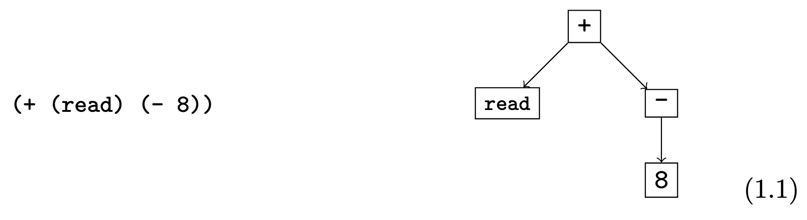

{slide pause}
---
# Essentials of Compilation: An Incremental Approach

## Goals

- Build a simple compiler
- Incremental approach
- Target: AT&T `x86-64`
- Simple language with variables and arithmetic expressions

{pause}

Everybody has got to start somewhere.

And we'll start with something REAL and EASY.
---

{slide pause}
---
## Non Goals

We won't write an assembler or linker.

{pause}

{.definition}
> Compiler - translates high-level code to assembly.

{pause}

Everybody has got to stop somewhere.

And we'll stop where it's SANE and SENSIBLE.
---

{slide pause}
---
## Host

Which language?

- Haskell
- Lean
- Rust
- Racket
- Python

My other implementations:
- `github.com/keilambda/eocia-lean`
- `github.com/keilambda/eocia-haskell`
---

{slide pause}
---
## Why OCaml?

Polymorphic variants and stupidly easy language.
---

{slide pause}
---
## What should you focus on???

{.block title="IMPORTANT"}
> The main part is implementing the compiler.
>
> Don't get bogged down by terminology that you might not know or didn't understand.
---

{slip pause}
---
## Basics

{.definition}
> Concrete syntax - program-as-text representation.

{pause}

{.definition}
> Abstract syntax - compiler internal representation.

{pause}

{.definition}
> Parsing - translating concrete syntax to abstract syntax.
---

{slide pause}
---

---

{slip pause}
---
## LVar (literals)

```clojure
42
```
---

{slip pause}
---
## LVar (operations)

{pause}

```clojure
(read)
```

{pause}

```clojure
(- exp)
```

{pause}

```clojure
(- 8)
(- (- 8))
```

{pause}

```clojure
(+ exp exp)
```

{pause}

```clojure
(+ 32 10)
(+ 32 (+ 5 5))
```

{pause}

```clojure
(- exp exp)
```

{pause}

```clojure
(- 52 10)
(- 52 (- 20 10))
```
---

{slip pause}
---
## LVar (let bindings & variables)

{pause}

```clojure
(let [var exp] exp)
      ─┬─ ─┬─  ─┬─
       │   │    └── body
       │   └─────── value
       └─────────── binder
```

{pause}

```clojure
(let [x 32] x)
```

{pause}

```clojure
(let [x (+ 12 20)] (+ 10 x))
```

{pause}

```clojure
(let [x 32]
  (+ (let [x 10] x) x))
```

{pause}

Shadowing:

```clojure
(let [x1 32]
  (+ (let [x2 10] x2) x1))
```
---

{slip pause}
---
## LVar (OCaml AST)

```ocaml
type null_op =
  | Read

type un_op =
  | Neg

type bin_op =
  | Add
  | Sub

type lvar =
  | Lit of int
  | Var of string
  | Let of string * lvar * lvar
  (*       ──┬───   ─┬──   ─┬──
             │       │      └── body
             │       └── value
             └── binder          *)
  | NulApp of null_op
  | UnApp of un_op * lvar
  | BinApp of bin_op * lvar * lvar
```
---

{slide pause}
---
## Interpreter

Before compiling, let's understand what LVar programs *mean*.

{pause}

Now we know the *semantics*. Let's compile it.
---

{slide pause}
---
## Runtime

`(read)` needs to read from stdin.

{pause}

We'll write a small `runtime.c` with `read_int`.

Our compiler outputs assembly, `gcc` links it with the runtime.
---

{slide pause}
---
## x86-64 (registers)

```
┌─────┬─────┬─────┬─────┐
│ rax │ rbx │ rcx │ rdx │
├─────┼─────┼─────┼─────┤
│ rsi │ rdi │ rbp │ rsp │
├─────┼─────┼─────┼─────┤
│ r8  │ r9  │ r10 │ r11 │
├─────┼─────┼─────┼─────┤
│ r12 │ r13 │ r14 │ r15 │
└─────┴─────┴─────┴─────┘
```

A register is a special kind of variable that holds a 64-bit value.
---

{slip pause}
---
## x86-64 (arguments)

{pause}

Immediate (literal value):

```x86asm
$42
```

{pause}

Register:

```x86asm
%rax
%rdi
```

{pause}

Memory location:

```x86asm
8(%rbp)
-16(%rbp)
```

```
offset
│
▼
8(%rbp)
  ─┬──
   └── base register
```
---

{slip pause}
---
## x86-64 (instructions)

{pause}

```
instr src dst
```

{pause}

```
addq src dst         ; dst = dst + src
subq src dst         ; dst = dst - src
negq dst             ; dst = -dst
movq src dst         ; dst = src
pushq src            ; push onto stack
popq dst             ; pop from stack
callq label          ; jumps to the procedure specified by the label
retq                 ; return from procedure to its caller
jmp label            ; jump to label
```

The last letter `q` indicates that these instructions operate on quadwords, which are 64-bit values.
---

{slide pause}
---
## Example: Only Registers

```x86asm
    .globl main
main:
    movq $32, %rax
    addq $10, %rax
    retq
```

{pause}

```
$ gcc -o simple simple.s
$ ./simple
$ echo $?
42
```
---

{slip pause}
---
## Example: Allocating on the stack (fragile)

```x86asm
    .globl main
main:
    subq $16, %rsp
    movq $10, 8(%rsp)
    negq 8(%rsp)
    movq 8(%rsp), %rax
    addq $52, %rax
    addq $16, %rsp
    retq
```

{pause}

```
$ gcc -o stack_fragile stack_fragile.s
$ ./stack_fragile
$ echo $?
42
```

{pause}

```
            .....
        ├───────────┤
8(%rsp) │    10     │ ┐
        ├───────────┤ ├── frame
 (%rsp) │  (empty)  │ ┘
        └───────────┘
```
---

{slip pause}
---
## Example: Allocating on the stack (with frame pointer)

```x86asm
    .globl main
main:
    pushq %rbp
    movq %rsp, %rbp
    subq $16, %rsp
    jmp start

start:
    movq $10, -8(%rbp)
    negq -8(%rbp)
    movq -8(%rbp), %rax
    addq $52, %rax
    jmp conclusion

conclusion:
    addq $16, %rsp
    popq %rbp
    retq
```

{pause}

```
$ gcc -o stack stack.s
$ ./stack
$ echo $?
42
```

{pause up}

```
              .....
          ├───────────┤
  8(%rbp) │ ret  addr │
          ├───────────┤
  0(%rbp) │ saved rbp │ ┐
          ├───────────┤ │
 -8(%rbp) │    10     │ ├── frame
          ├───────────┤ │
-16(%rbp) │  (empty)  │ ┴── (%rsp)
          └───────────┘
```

{pause}

The computer has a *program counter* (a.k.a *instruction pointer*) stored in the `rip` register and a *stack pointer* stored in the `rsp` register.

They are hardware-managed/implicit/special-purpose so to speak.

{pause}

The stack grows downward in memory, so we increase the size of the stack by subtracting from the stack pointer.

{pause}

In x86-64, the stack pointer `rsp` must be divisible by 16 bytes prior to the execution of any `callq` instruction.

{pause}

**Bonus:** `-fomit-frame-pointer`

{pause}

Fewer instructions and frees `rbp` for general use.
---

{slide pause}
---
## Passes

{pause}

1. `uniquify` - renames variables to unique names

{pause}

2. `remove_complex_operands` - ensures operands are atomic

{pause}

3. `explicate_control` - makes execution order explicit

{pause}

4. `select_instructions` - converts operations to x86 instructions

{pause}

5. `assign_homes` - replaces variables with registers/stack locations

{pause}

6. `patch_instructions` - fixes invalid memory-to-memory arguments

{pause}

7. `prelude_and_conclusion` - wraps main with setup/teardown
---

{slide pause}
---
```
LVar
 ▼ uniquify
LVar
 ▼ remove_complex_operands
LVarMon
 ▼ explicate_control
CVar
 ▼ select_instructions
X86Var
 ▼ assign_homes
X86Int
 ▼ patch_instructions
X86Int
 ▼ prelude_and_conclusion
X86Int
```
---

{slip pause}
---
## LVarMon

LVar but in *monadic form*.

{pause}

Operands must be atoms (literals or variables).

{pause}

LVar:
```clojure
(+ (+ 1 2) 3)
```

{pause}

LVarMon:
```clojure
(let [tmp.1 (+ 1 2)]
  (+ tmp.1 3))
```

{pause}

Complex operands get extracted into `let` bindings.

{pause}

Monad in "monadic form" is unrelated to Haskell's `Monad` typeclass.
---

{slip pause}
---
## CVar

Three-address code in *administrative normal form* (ANF).

```
x = y + z
```

{pause}

Like LVarMon, operands are atoms.

But now it's statement-based with a flat sequence of assignments that ends with `return` at tail position.

{pause}

LVar:
```clojure
(let [x (+ 1 2)]
  (let [y (+ x 3)]
    y))
```

{pause}

CVar:
```
x = 1 + 2
y = x + 3
return y
```
---

{slide pause}
---
## Uniquify Variables

```clojure
(let [x 32]
  (+ (let [x 10] x) x))
```

```clojure
(let [x.1 32]
  (+ (let [x.2 10] x.2) x.1))
```
---

{slide pause}
---
## Remove Complex Operands

Operands of operations must be atoms (literals or variables).

{pause}

```clojure
(let [x (+ 42 (- 10))]
  (+ x 10))
```

{pause}

```clojure
(let [x (let [tmp.1 (- 10)] (+ 42 tmp.1))]
  (+ x 10))
```
---

{slide pause}
---
## Explicate Control

Flatten nested `let`s into a sequence of assignments.

{pause}

```clojure
(let [y (let [x 20]
           (+ x (let [x 22] x)))]
  y)
```

{pause}

```
x.2 = 20
x.3 = 22
y.1 = (+ x.2 x.3)
return y.1
```
---

{slide pause}
---
## Select Instructions

Convert CVar operations to x86 instructions with variables. Variables become stack locations later.

{pause}

CVar:
```
x = 1 + 2
return x
```

{pause}

X86Var:
```x86asm
movq $1, x
addq $2, x
movq x, %rax
```

{pause}

Return value goes in `%rax` (calling convention).
---

{slide pause}
---
## Assign Homes

Replace variables with stack locations.

{pause}

X86Var:
```x86asm
movq $42, a
movq a, b
movq b, %rax
```

{pause}

X86Int:
```x86asm
movq $42, -8(%rbp)
movq -8(%rbp), -16(%rbp)
movq -16(%rbp), %rax
```
---

{slide pause}
---
## Patch Instructions

x86 doesn't allow memory-to-memory operations.

{pause}

```x86asm
movq -8(%rbp), -16(%rbp)
```

{pause}

```x86asm
movq -8(%rbp), %rax
movq %rax, -16(%rbp)
```
---

{slide pause}
---
## Prelude and Conclusion

Wrap the program with stack frame setup/teardown.

{pause}

```x86asm
    .globl main
main:
    pushq %rbp
    movq %rsp, %rbp
    subq $16, %rsp
    jmp start

start:
    ...
    jmp conclusion

conclusion:
    addq $16, %rsp
    popq %rbp
    retq
```
---

{slide pause}
---
## Takeaways

We've learnt (some) AT&T `x86-64` assembly, how stack works and calling conventions.

We've learnt (some) programming language design.

We've built a working compiler.
---

{slide pause}
---
## Where to go from here?

Play around with/hack the compiler.

Chapter 4, 5.

On the deathbed you won't miss writing getters and setters and factories.

FOMO.

- Graphics
- Game dev
- Databases
- Math
- ML
- ... you name it
---

{slide pause}
---
## References

*Essentials of Compilation: An Incremental Approach*
Jeremy G. Siek

`github.com/IUCompilerCourse/Essentials-of-Compilation`
---

{slide pause}
---
## Go explore.
---
